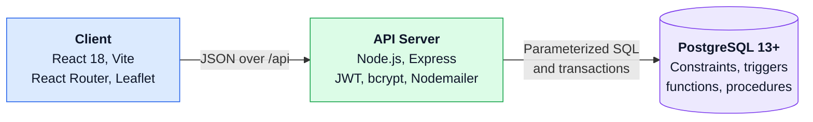
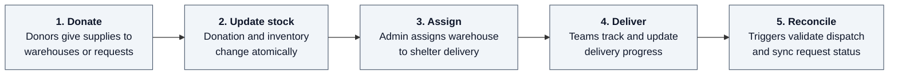
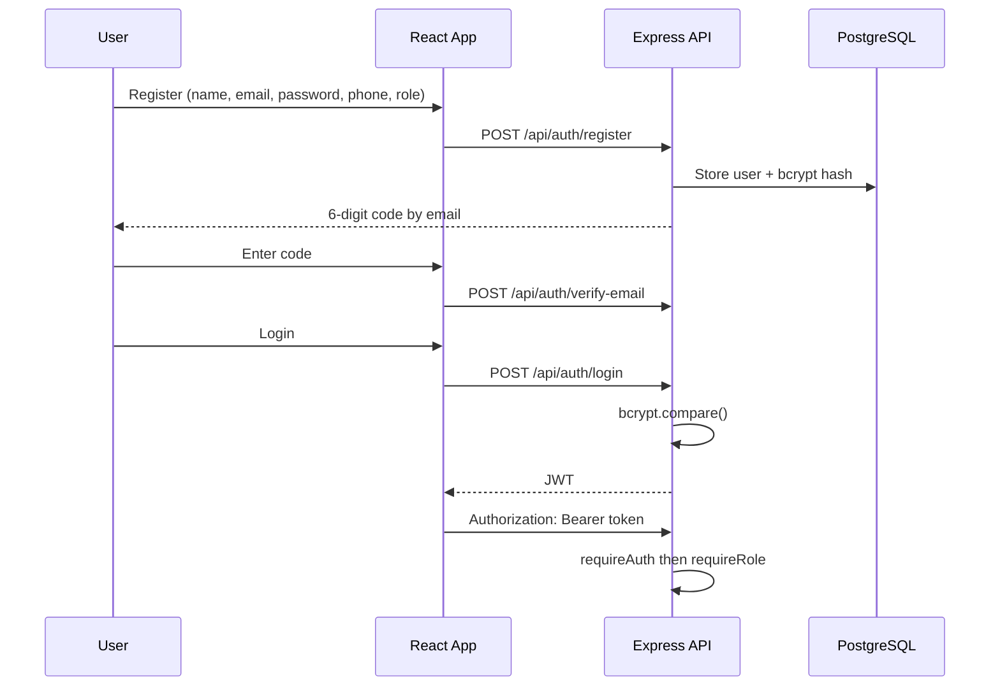
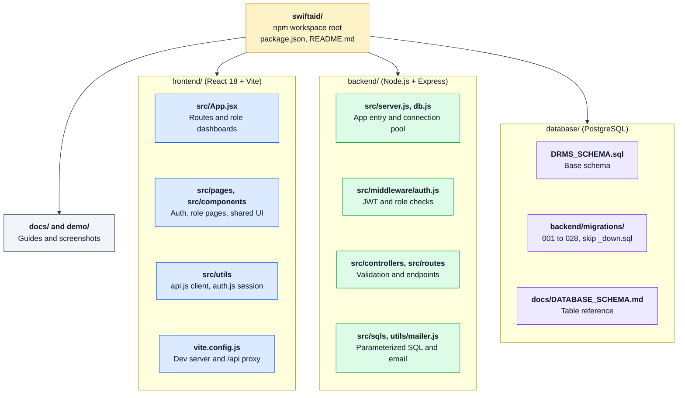

<div align="center">

# SwiftAid

**Disaster Relief Management System**

A full-stack coordination platform for administrators, donors, response teams, and volunteers,<br/>
with permissions and stock integrity enforced on the server and inside PostgreSQL.

React 18 &nbsp;·&nbsp; Vite &nbsp;·&nbsp; Node.js &nbsp;·&nbsp; Express &nbsp;·&nbsp; PostgreSQL &nbsp;·&nbsp; JWT &nbsp;·&nbsp; Leaflet

[Features](#key-features) &nbsp;|&nbsp;
[Screenshots](#screenshots) &nbsp;|&nbsp;
[Architecture](#architecture) &nbsp;|&nbsp;
[Workflow](#relief-workflow) &nbsp;|&nbsp;
[Database](#database-engineering) &nbsp;|&nbsp;
[Quick Start](#quick-start) &nbsp;|&nbsp;
[API](#api-overview) &nbsp;|&nbsp;
[Structure](#project-structure) &nbsp;|&nbsp;
[Troubleshooting](#troubleshooting)

</div>

---

## Overview

When a disaster strikes, coordination is everything. **SwiftAid** gives every stakeholder a shared operational view of **disasters, shelters, victims, supplies, relief requests, donations, and deliveries**, with business rules enforced **on the server and inside PostgreSQL**, not just in the UI.

> **Engineering focus:** raw parameterized SQL (no ORM), ACID transactions, row-level locking, triggers, stored functions/procedures, and audit logs.

---

## Key Features

| Area | Capability |
|---|---|
| **Authentication** | Email verification, bcrypt password hashing, JWT sessions, role-based authorization |
| **Role workflows** | Separate dashboards for `admin`, `donor`, `team`, and `volunteer` |
| **Disasters** | Registration with reusable locations and map coordinates |
| **Shelters and victims** | Victim assignment with shelter-capacity validation |
| **Inventory** | Warehouse and shelter stock with add and remove operations |
| **Donations** | Donation records and stock levels update atomically in one transaction |
| **Relief requests** | Item-level requested, dispatched, remaining, and fulfillment status |
| **Distributions** | Warehouse-to-shelter assignment and delivery tracking |
| **Teams** | Team registration, volunteer membership, admin approval or rejection with remarks |
| **Maps** | Responsive React dashboards with Leaflet maps and heat maps |

---

## Screenshots

<table>
  <tr>
    <td align="center" width="50%">
      <br/>
      <b>Sign In</b>
    </td>
    <td align="center" width="50%">
      <br/>
      <b>Email Verification</b>
    </td>
  </tr>
  <tr>
    <td align="center">
      <br/>
      <b>Team Approval</b>
    </td>
    <td align="center">
      <br/>
      <b>Shelters & Warehouses Map</b>
    </td>
  </tr>
  <tr>
    <td align="center">
      <br/>
      <b>Victim Registry</b>
    </td>
    <td align="center">
      <br/>
      <b>Warehouse Inventory</b>
    </td>
  </tr>
  <tr>
    <td align="center">
      <br/>
      <b>Relief Requests</b>
    </td>
    <td align="center">
      <br/>
      <b>Distribution Assignment</b>
    </td>
  </tr>
</table>

---

## Architecture



| Layer | Technologies |
|---|---|
| **Frontend** | React 18, Vite, React Router DOM, React Leaflet, Leaflet heat maps |
| **Backend** | Node.js, Express, `pg`, bcrypt, JSON Web Tokens, Nodemailer |
| **Database** | PostgreSQL 13+ with raw parameterized SQL (no ORM) |

### User Roles

| Role | Main capabilities |
|---|---|
| **Admin** | Manage disasters, teams, shelters, warehouses, items, victims, inventory, donations, relief requests, and distributions |
| **Donor** | Donate supplies to warehouses or eligible relief requests; view personal donation history |
| **Team** | Create response teams, select volunteers, view distributions, update delivery progress |
| **Volunteer** | View disasters, join available teams, manage team membership |

> Authorization is enforced by **backend middleware**. Frontend route protection only improves UX and is not the security boundary.

---

## Relief Workflow



---

## Database Engineering

The backend uses a shared connection pool and named SQL modules under `backend/src/sqls/`. User input is always passed as parameters (`$1`, `$2`, …) and never concatenated into SQL.

| Safeguard | What it does |
|---|---|
| **Constraints** | Unique, foreign key, and check constraints for valid relationships and quantities |
| **Transactions** | Donations, inventory changes, distributions, and relief workflows are atomic |
| **Row locks** | Prevent race conditions on concurrent stock and request updates |
| **Audit logs** | Trigger-based inventory audit trail |
| **Over-dispatch guard** | Trigger prevents dispatched quantity from exceeding requested quantity |
| **Auto status sync** | Trigger keeps relief-request fulfillment status up to date |
| **Stored logic** | Functions and procedures for capacity, availability, summaries, donations, and delivery |

Full table reference: [`docs/DATABASE_SCHEMA.md`](docs/DATABASE_SCHEMA.md)

---

## Authentication Flow



> Passwords can't be decrypted. bcrypt adds a random salt, so the same password produces different hashes, and login uses `bcrypt.compare`.

---

## Quick Start

### Prerequisites

- Node.js **18+** and npm
- PostgreSQL **13+**
- SMTP credentials (Gmail App Password) if email verification is enabled

### Step 1: Clone and install

```bash
git clone <repository-url>
cd <repository-folder>
npm install
```

> Check that the root contains `DRMS_SCHEMA.sql`, `backend/`, and `frontend/`.

### Step 2: Create the database

```bash
createdb -U postgres drms
```

### Step 3: Apply schema and migrations

```bash
psql -U postgres -d drms -f DRMS_SCHEMA.sql
```

Then run every file in `backend/migrations/` **in numeric order** (`001_...sql` through `028_...sql`).

> **Do not run `_down.sql` files**; those are rollback scripts. Apply each migration only once.
> Navicat users: execute `DRMS_SCHEMA.sql`, then each numbered migration in order against the `drms` database.

### Step 4: Configure `backend/.env`

```env
PORT=5000
DB_HOST=localhost
DB_PORT=5432
DB_NAME=drms
DB_USER=postgres
DB_PASSWORD=your_database_password
JWT_SECRET=replace_with_a_long_random_secret
JWT_EXPIRES_IN=8h
SMTP_USER=your_gmail_address@gmail.com
SMTP_APP_PASSWORD=your_gmail_app_password
```

> For Gmail, enable 2-Step Verification and create an **App Password**; don't use your normal password.
> Never commit `.env`, passwords, JWT secrets, or API keys.

### Step 5: Run the app

```bash
npm run dev
```

Or in two terminals:

```bash
npm run dev:backend     # Terminal 1
npm run dev:frontend    # Terminal 2
```

| Service | URL |
|---|---|
| Frontend | http://localhost:5173 |
| Backend | http://localhost:5000 |
| Health check | http://localhost:5000/api/health |

### Step 6: Verify

```bash
curl http://localhost:5000/api/health
```

```json
{ "status": "ok", "db": "connected" }
```

Then register at http://localhost:5173/register, verify your email code, and sign in.

<details>
<summary><b>Production-style commands</b></summary>

```bash
npm run build -w frontend
npm start -w backend
```

</details>

---

## API Overview

All routes are prefixed with `/api`.

| Area | Main Endpoints |
|---|---|
| Authentication | `/auth/register` · `/auth/login` · `/auth/me` · `/auth/verify-email` · `/auth/resend-code` |
| Disasters | `/disasters` · `/disasters/:id/status` |
| Teams | `/teams` · `/teams/mine` · `/teams/pending` · `/teams/:id/approve` · `/teams/:id/reject` |
| Shelters | `/shelters` · `/shelters/:id` |
| Warehouses | `/warehouses` · `/warehouses/:id` |
| Items | `/items` · `/items/:id` |
| Victims | `/victims` · `/victims/:id` |
| Inventory | `/inventory` · `/inventory/adjust` · `/inventory/:id` |
| Donations | `/donations` · `/donations/mine` · `/donations/:id` |
| Relief Requests | `/relief-requests` · `/relief-requests/:id/donate` |
| Shelter Inventory | `/shelter-inventory` |
| Distributions | `/distributions` and status actions |

**Status codes:** `400` invalid input · `401` missing/invalid auth · `403` forbidden · `404` not found · `409` conflict · `500` server error

---

## Project Structure



<details>
<summary><b>Full file tree</b></summary>

```text
.
├── DRMS_SCHEMA.sql                 Base PostgreSQL schema
├── README.md                       Setup, usage, and troubleshooting
├── PROJECT_GUIDELINES.md           Course project requirements
├── package.json                    Root workspace scripts
├── demo/                           Application screenshots
├── docs/
│   ├── AGENTS.md                   Architecture and contribution guidance
│   └── DATABASE_SCHEMA.md          Table and relationship reference
├── backend/
│   ├── migrations/                 Numbered schema and database-object migrations
│   └── src/
│       ├── server.js               Express app and route mounting
│       ├── db.js                   PostgreSQL connection pool
│       ├── middleware/auth.js      JWT and role middleware
│       ├── controllers/            Validation and business workflows
│       ├── routes/                 API endpoint definitions
│       ├── sqls/                   Parameterized SQL and database objects
│       └── utils/mailer.js         Gmail SMTP verification mailer
└── frontend/
    ├── vite.config.js              Vite server and /api proxy
    └── src/
        ├── App.jsx                 Routes and role dashboards
        ├── components/             Shared dashboard components
        ├── pages/                  Auth and role-specific pages
        ├── styles/                 Page-specific styles
        ├── styles.css              Shared styles
        └── utils/
            ├── api.js              Centralized API client
            └── auth.js             Token and session storage
```

</details>

---

## Troubleshooting

<details>
<summary><b><code>npm run dev</code> does not start</b></summary>

- Confirm the terminal is in the repository **root**, not inside `backend/` or `frontend/`.
- Run `npm install` again from the root.
- Check that Node.js is version 18 or newer.
- Start each side separately with `npm run dev:backend` and `npm run dev:frontend` to see which one fails.

</details>

<details>
<summary><b><code>ECONNREFUSED</code> or <code>database unreachable</code></b></summary>

- Confirm PostgreSQL is running.
- Confirm `DB_HOST`, `DB_PORT`, `DB_NAME`, `DB_USER`, `DB_PASSWORD` in `backend/.env`.
- Test the credentials directly:

  ```bash
  psql -h localhost -p 5432 -U postgres -d drms
  ```

- Confirm `DRMS_SCHEMA.sql` and all numbered migrations were executed against `drms`.

</details>

<details>
<summary><b><code>relation does not exist</code> or missing function/procedure</b></summary>

The base schema or a migration is missing. Apply `DRMS_SCHEMA.sql`, then every numbered migration in order. Never apply `_down.sql` files. Restart the backend afterward.

</details>

<details>
<summary><b>Port 5000 or 5173 already in use</b></summary>

Stop the process using the port, or change the backend `PORT` and the proxy target in `frontend/vite.config.js` together so they match.

</details>

<details>
<summary><b>No verification email arrives</b></summary>

- Confirm `SMTP_USER` and `SMTP_APP_PASSWORD` exist in `backend/.env`.
- For Gmail, use a 16-character **App Password**.
- Restart the backend after changing `.env`.
- Look for `[auth/register] email failed` in the backend terminal.
- Use **Resend code** after the 60-second cooldown.

</details>

<details>
<summary><b>Login says email verification is required</b></summary>

Open `/verify-email` and enter the six-digit code. Codes expire after 15 minutes and have a limited number of attempts; request a new one if needed.

</details>

<details>
<summary><b><code>Invalid email or password</code></b></summary>

Confirm the email is registered and you're using the original plain password. Never compare two bcrypt hashes directly, because each uses a different salt. The backend verifies with `bcrypt.compare`.

</details>

<details>
<summary><b>API returns 401 or 403</b></summary>

- `401`: JWT is missing, invalid, or expired. Sign out and sign in again.
- `403`: you're authenticated but your role isn't allowed to do that action.
- Don't edit the role in browser storage; the backend enforces it from the token and database.

</details>

<details>
<summary><b>Map tiles or geocoding don't load</b></summary>

Check the browser network panel and confirm internet access. The app uses Leaflet tiles and a backend geocoding route; everything else still runs without map data.

</details>

<details>
<summary><b>Changes aren't visible in the browser</b></summary>

Confirm the frontend runs on http://localhost:5173, refresh, and check the console. Restart the backend if the API changed, and re-run `npm install` if dependencies changed.

</details>

---

<div align="center">

**Built to keep relief moving when every minute counts.**<br/>
If you find this project interesting, consider giving it a star.

</div>
